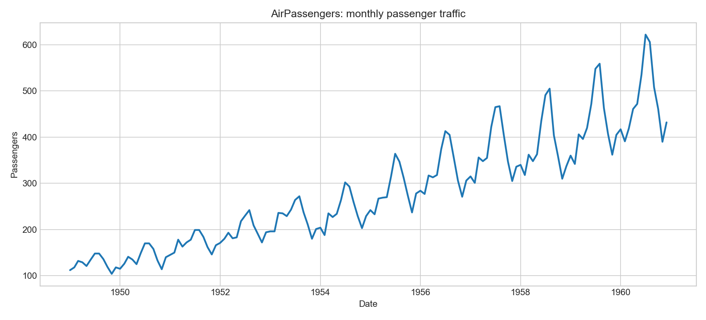
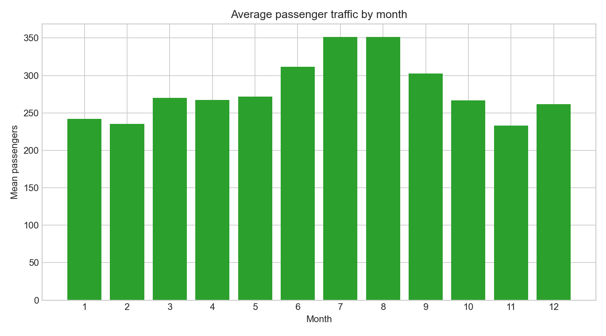
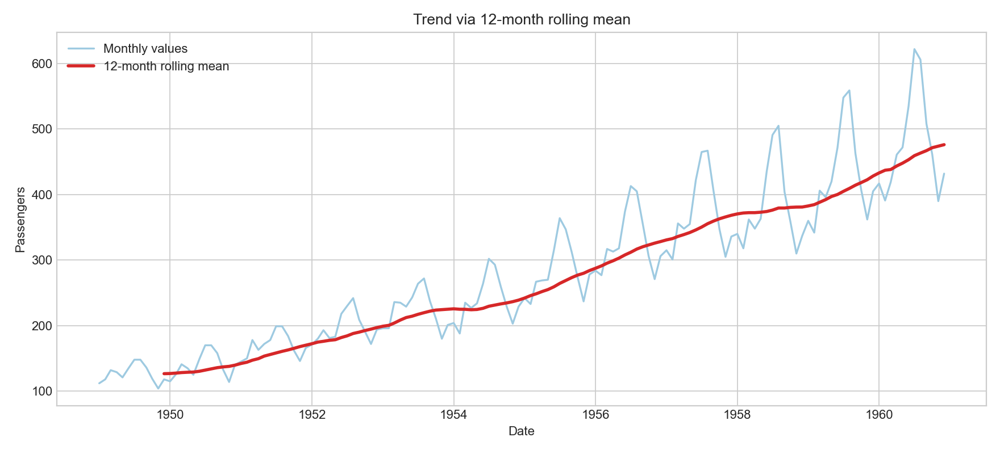
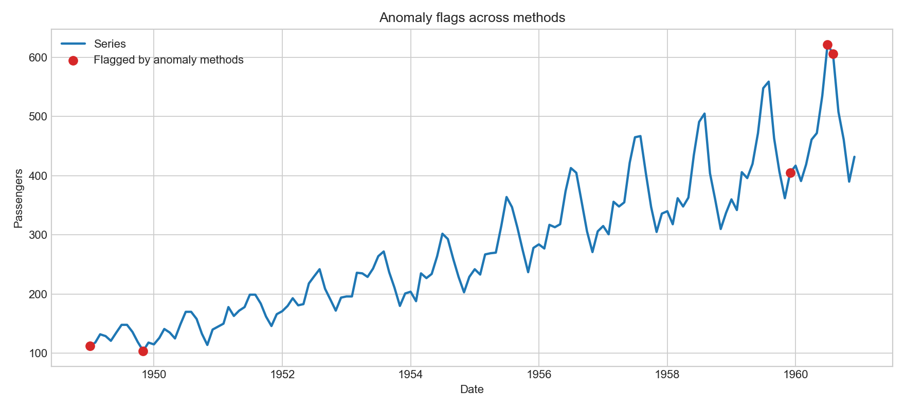
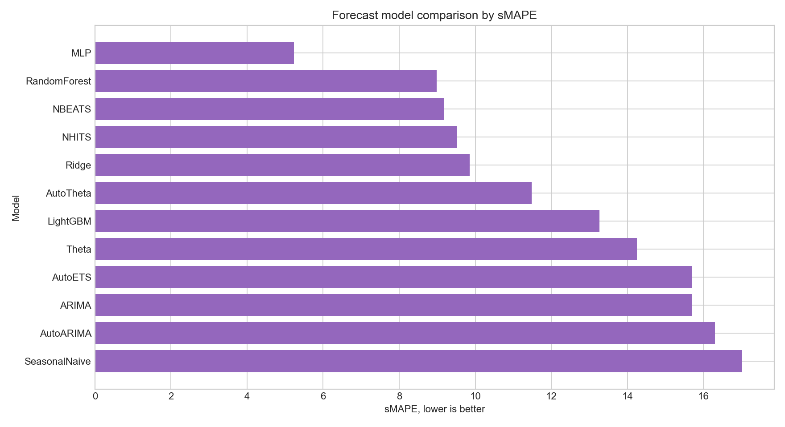
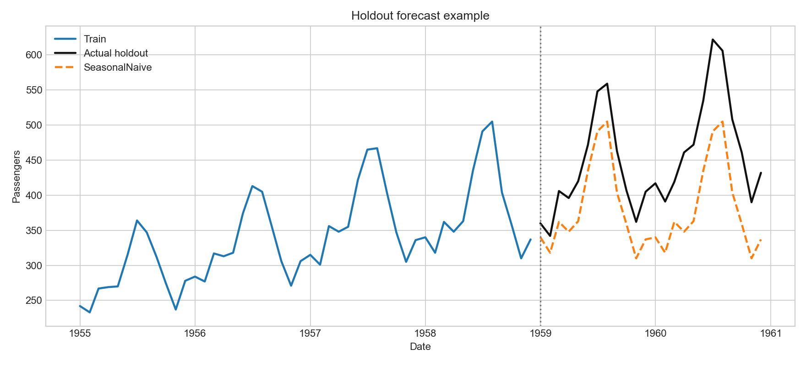
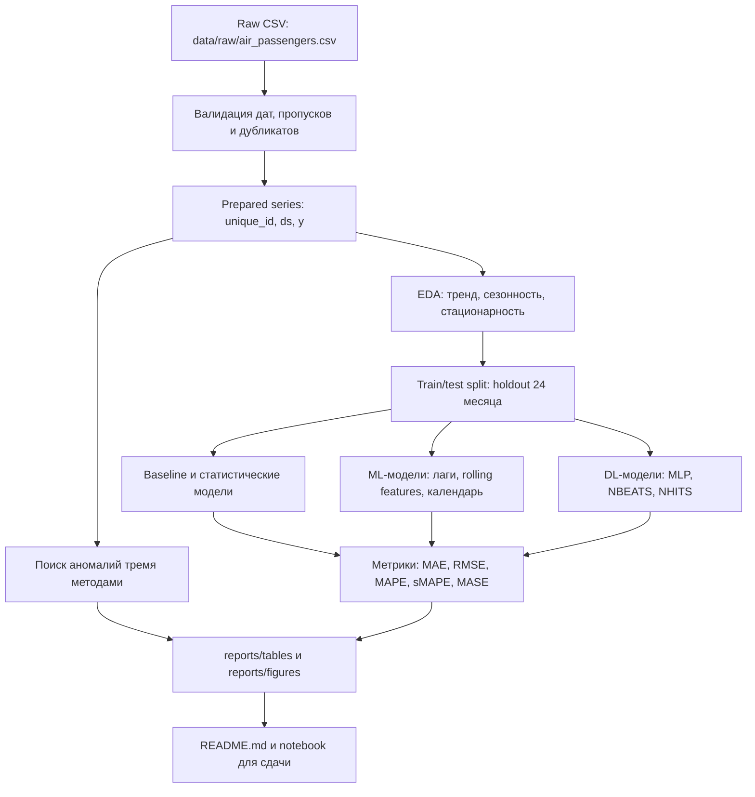

# Итоговое задание по анализу временных рядов

## 1. Описание временного ряда

В проекте используется классический набор данных **AirPassengers**: месячное число международных авиапассажиров, 1949-01 - 1960-12, 144 наблюдения. Ряд выбран потому, что в нем явно видны тренд, годовая сезонность и рост амплитуды сезонных колебаний. Это делает его удобным для сравнения статистических, ML и DL методов прогнозирования.

Файл данных: `data/raw/air_passengers.csv`.

Подготовленный формат соответствует требованиям `statsforecast`, `mlforecast` и `neuralforecast`:

| column | meaning |
|---|---|
| `unique_id` | идентификатор ряда |
| `ds` | временная метка |
| `y` | целевая переменная |

## 2. Постановка задачи

Задача: построить офлайн-пайплайн прогнозирования месячного пассажиропотока на горизонт **24 месяца**.

| Параметр | Выбор |
|---|---|
| Частота | monthly start, `MS` |
| Горизонт | 24 месяца |
| Тип модели | локальная модель для одного ряда |
| Глобальные модели | не обязательны, но ML/DL проверяются как data-driven альтернативы |
| Режим | офлайн, пакетное переобучение |
| Метрики | MAE, RMSE, MAPE, sMAPE, MASE |
| Основная метрика выбора | sMAPE + MASE |
| Валидация | holdout последних 24 месяцев, при расширении - rolling backtesting |

## 3. EDA и подготовка данных

Базовые проверки выполняются в `src/data.py` и `src/eda.py`.

Ключевые результаты EDA:

| Проверка | Результат |
|---|---|
| Количество наблюдений | 144 |
| Период | 1949-01-01 - 1960-12-01 |
| Пропуски в `y` | 0 |
| Дубликаты временных меток | 0 |
| Частота | месячная |
| Сезонность | выраженная годовая, период 12 |
| Тренд | устойчивый восходящий |
| Дисперсия | растет вместе с уровнем ряда |
| Рекомендация | использовать `log(y)` и сезонное дифференцирование для диагностик |

Интерпретация: ряд нестационарен по среднему и дисперсии. Для статистических моделей оправданы сезонное дифференцирование и/или мультипликативная сезонность. Для ML/DL нужны лаги `1, 2, 3, 6, 12, 24`, календарные признаки и скользящие средние.







## 4. Анализ аномалий

Аномалии исследуются тремя методами:

| Метод | Параметры | Обоснование |
|---|---|---|
| Seasonal difference z-score | `diff_12`, threshold `3.0` | Убирает годовую сезонность и ищет резкие отклонения относительно прошлого года |
| Monthly robust IQR | `multiplier=1.5` | Сравнивает месяц только с тем же месяцем прошлых лет, устойчив к тренду |
| IsolationForest | `contamination=0.03` | Нелинейный data-driven метод по уровню, месяцу, `log_y` и сезонной разности |

Для данного ряда сильных предметных аномалий обычно не ожидается: экстремальные значения в июле-августе объясняются сезонностью, а не ошибками данных. Поэтому финальная стратегия - не удалять точки автоматически, а использовать флаги аномалий как диагностические признаки.



## 5. Сравнение методов прогнозирования

Код запуска моделей находится в:

- `src/models_statistical.py` - `statsforecast`
- `src/models_ml.py` - `mlforecast`
- `src/models_dl.py` - `neuralforecast`
- `src/pipeline.py` - единый пайплайн

### Статистические методы

| Метод | Режим | Параметры | Обоснование |
|---|---|---|---|
| Naive | baseline | последний уровень | Минимальный бейзлайн |
| SeasonalNaive | baseline | `season_length=12` | Сильный бейзлайн при годовой сезонности |
| HistoricAverage | baseline | среднее по train | Проверка пользы тренда и сезонности |
| ARIMA | ручной | `(0,1,1)(0,1,1)[12]` | Сезонная ARIMA для нестационарного ряда |
| AutoARIMA | авто | `season_length=12` | Автоподбор порядков по информационному критерию |
| AutoETS | авто | `season_length=12` | Подбор тренда и сезонности экспоненциального сглаживания |
| Theta | ручной | `season_length=12` | Компактная трендовая модель |
| AutoTheta | авто | `season_length=12` | Автовариант Theta |

Ожидаемый выбор после бектестинга: `AutoETS` или `AutoARIMA`, потому что ряд короткий, сезонный и трендовый. Если нейросетевые модели не дают устойчивого выигрыша на holdout, статистическая модель предпочтительнее из-за интерпретируемости и стабильности.

### ML методы

| Метод | Feature engineering | Обоснование |
|---|---|---|
| Ridge | лаги, календарь, rolling mean | Интерпретируемый регуляризованный ML-бейзлайн |
| RandomForest | лаги, календарь, rolling mean | Нелинейность и устойчивость к выбросам |
| LightGBM | лаги, календарь, rolling mean | Сильный табличный бустинг для лаговых признаков |

ML-подход проверяет, достаточно ли лаговых и календарных признаков для обгона статистических моделей. На коротком ряде риск переобучения выше, поэтому глубина деревьев и сложность бустинга ограничены.

### DL методы

| Метод | Параметры | Обоснование |
|---|---|---|
| MLP | `input_size=24`, `h=24` | Нейросетевой бейзлайн на лаговом окне |
| NBEATS | `input_size=24`, `h=24` | Хорошо моделирует трендовые и сезонные компоненты |
| NHITS | `input_size=24`, `h=24` | Часто устойчив на длинных горизонтах |

DL-модели включены для выполнения data-driven части задания. Для одного короткого ряда они должны сравниваться особенно осторожно: качество оценивается не только по метрикам, но и по стабильности при повторных запусках.

## 6. Результаты тестирования моделей

Тестирование выполнено на holdout-выборке: последние 24 месяца ряда. Основная метрика ранжирования - `sMAPE`, дополнительно контролируются `MAE`, `RMSE`, `MAPE` и `MASE`.

| Категория | Модель | MAE | RMSE | MAPE | sMAPE | MASE |
|---|---|---:|---:|---:|---:|---:|
| DL | MLP | 24.46 | 29.91 | 5.29 | 5.23 | 0.86 |
| ML | RandomForest | 40.57 | 53.37 | 8.40 | 8.99 | 1.42 |
| DL | NBEATS | 38.27 | 42.43 | 8.69 | 9.19 | 1.34 |
| DL | NHITS | 38.90 | 42.89 | 8.98 | 9.52 | 1.36 |
| ML | Ridge | 41.11 | 45.91 | 9.28 | 9.86 | 1.44 |
| Statistical | AutoTheta | 51.20 | 58.67 | 10.75 | 11.49 | 1.79 |
| ML | LightGBM | 60.64 | 80.28 | 12.12 | 13.27 | 2.12 |
| Statistical | Theta | 62.34 | 70.56 | 13.15 | 14.25 | 2.18 |
| Statistical | AutoETS | 67.94 | 78.37 | 14.30 | 15.69 | 2.38 |
| Statistical | ARIMA | 66.34 | 71.89 | 14.42 | 15.70 | 2.32 |
| Baseline | SeasonalNaive | 71.25 | 76.99 | 15.52 | 17.01 | 2.49 |

По текущему прогону лучший результат показала модель `MLP`: она лучше сезонного бейзлайна по всем метрикам. При этом из-за малого размера ряда финальный вывод не должен опираться только на один запуск DL-модели; для надежного выбора модель стоит дополнительно проверять rolling backtesting и повторными запусками с разными random seed.





## 7. Пайплайн

Пайплайн состоит из этапов:

1. Загрузка и валидация данных.
2. Приведение к формату `unique_id`, `ds`, `y`.
3. EDA и сохранение таблиц качества.
4. Train/test split: последние 24 месяца как holdout.
5. Обучение baseline/statistical/ML/DL моделей.
6. Расчет MAE, RMSE, MAPE, sMAPE, MASE.
7. Поиск аномалий тремя методами.
8. Сохранение результатов в `reports/tables`.

Команды запуска:

```bash
pip install -r requirements.txt
python -m src.pipeline --mode prepare
python -m src.pipeline --mode quick
python -m src.pipeline --mode full
```

Режимы:

| Режим | Что делает |
|---|---|
| `prepare` | готовит данные и EDA-таблицы |
| `quick` | считает быстрые бейзлайны без тяжелых фреймворков |
| `full` | запускает `statsforecast`, `mlforecast`, `neuralforecast` и anomaly suite |

### Структура пайплайна



Техническая структура пайплайна:

| Этап | Модуль | Выход |
|---|---|---|
| Загрузка и подготовка | `src/data.py` | `data/processed/air_passengers_prepared.csv` |
| EDA | `src/eda.py` | `reports/tables/eda_*.csv`, `stationarity_notes.json` |
| Аномалии | `src/anomaly.py` | `reports/tables/anomalies_results.csv` |
| Статистические модели | `src/models_statistical.py` | `reports/tables/statistical_results.csv` |
| ML-модели | `src/models_ml.py` | `reports/tables/ml_results.csv` |
| DL-модели | `src/models_dl.py` | `reports/tables/dl_results.csv` |
| Метрики | `src/metrics.py` | таблицы качества прогноза |
| Графики | `src/visualization.py` | `reports/figures/*.png` |
| Оркестрация | `src/pipeline.py` | режимы `prepare`, `quick`, `full` |

## 8. Тестирование пайплайна

Функциональные проверки:

- CSV читается в `pandas`.
- Временная метка приводится к `datetime64`.
- Частота ряда не имеет пропущенных месяцев.
- Дубликаты дат отсутствуют.
- Горизонт меньше длины ряда.
- Метрики считаются на одинаковых индексах test и forecast.

Производительность:

- `prepare` и `quick` должны выполняться за секунды.
- `full` зависит от CPU/GPU и установки `torch`; для короткого ряда ожидается интерактивное время выполнения.
- Для DL ограничено `max_steps=500`, чтобы избежать неоправданно долгого обучения.

## 9. Вывод

Для ряда AirPassengers в текущем holdout-тесте лучший результат показала `MLP`, а сильным практическим ориентиром остается сравнение с `SeasonalNaive` и статистическими сезонными моделями (`AutoTheta`, `AutoETS`, `AutoARIMA`). Из-за малого объема данных DL-модель стоит принимать как финальный выбор только после rolling backtesting, повторных запусков и нормальной диагностики остатков.

Ноутбук с кодом и комментариями: `notebooks/final_timeseries_project.ipynb`.

## 10. Структура репозитория

```text
Kuliashov-Denis/
├── README.md
├── requirements.txt
├── data/
│   ├── raw/
│   │   └── air_passengers.csv
│   └── processed/
│       └── air_passengers_prepared.csv
├── notebooks/
│   └── final_timeseries_project.ipynb
├── reports/
│   ├── figures/
│   │   ├── 01_monthly_series.png
│   │   ├── 02_monthly_seasonality.png
│   │   ├── 03_trend_rolling.png
│   │   ├── 04_anomalies.png
│   │   ├── 05_model_comparison.png
│   │   └── 06_holdout_forecast.png
│   └── tables/
│       ├── anomalies_results.csv
│       ├── anomaly_methods.csv
│       ├── data_quality.json
│       ├── dl_results.csv
│       ├── ml_results.csv
│       ├── model_selection.csv
│       ├── quick_baseline_metrics.csv
│       └── statistical_results.csv
└── src/
    ├── anomaly.py
    ├── config.py
    ├── data.py
    ├── eda.py
    ├── metrics.py
    ├── models_dl.py
    ├── models_ml.py
    ├── models_statistical.py
    ├── pipeline.py
    └── visualization.py
```
